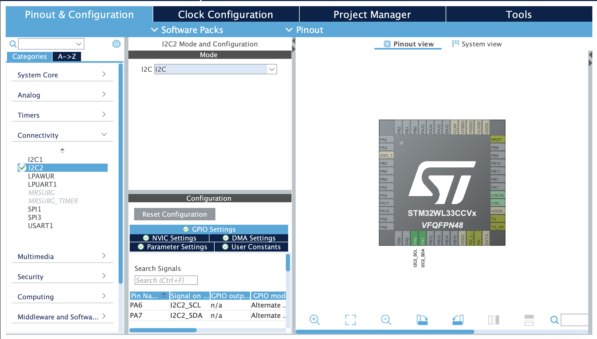

# Instructions

## I2C

We're going to talk to our temperature sensor (and our other sensors) using a communication protocol called [I2C](https://en.wikipedia.org/wiki/I%C2%B2C). 
I2C uses two lines to enact communication - a clock (SCL) to establish timing between devices and a data line (SDA) to actually send and receive data. These
two lines are the I2C bus over which our master process (the MCU) talks to its slave processes (our sensors). Let's start by building the circuit.

## The Circuit

### Setting up the Bus

Our bus is composed of only two lines - SCL (clock) and SDA (data). Both of these need to be pulled up using pullup resistors as the I2C communication works by pulling the lines on the bus low. So on our breadboard we can chose to columns to connect straight into the positive side of our powerrail. 

From there setting up our bus is as simple as connecting the SCL and SDA pins on our MCU to the bus and likewise with our temperature sensor. Given we're using a STM32WL33CC6 we look at the datasheet and find that SCL is on pin PA6 (3-CN4 on nucleo) and SDA is on pin PA7 (5-CN4 on nucleo) so we'll need to connect these into our breadboard. Then looking at the datasheet for our MCP9808 (temperature sensor) we'll find that SLC is on pin 2 and SDA is on pin 1 so we'll need to connect those to the breadboard as well. 

### Creating an Address

I2C is able to communicate with multiple devices by virtue of assigning individual 7 bit addresses to each of the slaves. Looking at the datasheet for the MCP9808 we'll find that pins 5-7 determine our address - that is we will set the address by pulling these pins low or high. We'll go ahead and just pull them all to low by connecting them directly to the ground of our breadboard's powerrail. According to the datasheet this will give us an address of 0011000. To store this in an 8bit int in our code we'll set the last bit to 0 for a 00110000 in total. 

### Powering the Sensor

Finally we need to pass power to the sensor and I2C bus. 

Looking at the datasheet we can see that 3.3V power on the nucleo is on 16-CN3 so we'll connect that to our powerrail's positive. For ground we can use 9-CN4 on the nucleo and connect that to the ground on our powerrail. If you've got a bare CPU you can just connect into whatever power is powering the MCU. It's good practice to use a small capacitor (104) between power and ground in order to eliminate any high frequency noise. 

Finally looking at the datasheet for the MCP9808 we can see that power goes to pin 8 and ground to pin 4. 

## Code

### Setup

The first thing to do when creating a new project in the STM32CubeIDE is to use CubeMX tool to configure pins. In our case we can simply go to connectivity and enable I2C2. This will setup our SCL and SDA pins for us. 



### The C Code

```C
int main(void)
{

  /* Reset of all peripherals, Initializes the Flash interface and the Systick. */
  HAL_Init();

  /* Configure the system clock */
  SystemClock_Config();

  /* Configure the peripherals common clocks */
  PeriphCommonClock_Config();

  /* Initialize all configured peripherals */
  MX_GPIO_Init();
  MX_I2C2_Init();

  uint16_t devAddress = 0x30;   /* Temperature sensor I2C address */
  uint8_t tempReg = 0x05u;      /* Temperature register address */
  uint8_t dataReg[2];           /* Buffer for reading the register content */
  uint16_t dataRegLong;         /* Variable used to store the whole register content */
  float tempVal = 0;            /* Float variable used for storing the temperature value */
  float tempValDec;

  while (1)
  {
    /* Start communication by asking to read from the temperature register */
	HAL_StatusTypeDef read_request_status  = HAL_I2C_Master_Transmit(&hi2c2, devAddress, &tempReg, 1, 2000u);
	uint32_t read_request_status_error = HAL_I2C_GetError(&hi2c2);
	/* Now read from the register itself */
	HAL_StatusTypeDef read_status = HAL_I2C_Master_Receive(&hi2c2, devAddress, dataReg, 2, 2000u);
	uint32_t read_error = HAL_I2C_GetError(&hi2c2);

	/* Compose the register content, regardless of the endianess */
	dataRegLong = ((dataReg[0] << 8u) | dataReg[1]);

	/* Extract the integer part from the fixed point value */
	tempVal = ((dataRegLong & 0x0FFF) >> 4);

	/* Extract decimal part */
	tempValDec = 0.0625;
	for (int i=0; i < 4; i++)
	{
		tempVal += ((dataRegLong >> i) & 0x0001) * tempValDec;
		tempValDec *= 2u;
	}
  }

}
```

The important things to note from this code are:

1. We have to write to the I2C bus to tell the sensor (using its address) that we want to read from its temperature register. Note that register was pulled from the datasheet. There are several registers we can pull from on the sensor. This is the one that we want. 
2. Once we have told the sensor we want to read from it we then need to fill a buffer with the data. 
3. Using the data we can convert to an actual temperature.
4. Finally access to the error codes is very very useful for debugging.

## Flashing and Running

Connect your MCU to your stlink and then run this program under debug. Set a breakpoint somewhere in the loop so you can read the temperature with each loop and make sure everything is working! If it doesn't read the error codes (ChatGPT is really good at interpreting them and suggesting fixes)

