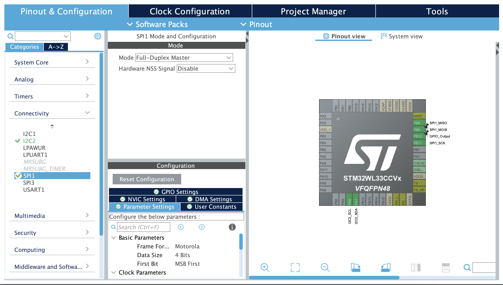

# Instructions

## SPI

In this case SPI uses 4 different lines to create its bus to one subnode. A MOSI (main out subnode in), MISO (main in subnode out), and SCK (clock) that can be shared by everything connected to the bus. Finally rather than using addresses the SPI protocol indicates who the main node wants to talk to by pull a CS (chip select) line low connected to the subnode in question when it wants to communicate. This last pin can be any GPIO output pin we like on the MCU but the other three should take advantage of the SPI pins on the device. 

## The Circuit

### Setting up the Bus

First on our MCU MOSI is PB9 (CN4 15 on the nucleo), MISO is PB8 (CN4 13), and SCK is PB11 (CN4 11) so we'll connect those all to our breadboard. Looking at the datasheet for the MX25V5126FM1I we can see that input is on pin 5, output is on pin 2, and the clock is on 6 so we connect these up to our breadboard as well. 

### Chip Select

Now we simply need to choose a GPIO Output pin that we can connect to the pin 1 on the flash (CS). We'll take advantage of PA14 (CN 19).

### Powering the Flash

VCC is pin 8 so we can pop that into our positive powerrail. Then pin 4 goes to ground. Finally we need to connect pin 3 (Write Protect) to power through a pull up resistor this will ensure we've disabled write protection. 


## Code

### Setup

We need to setup SPI1 connectivity and set it to full duplex master. Then because the default pin for MOSI is PB3 we move it to PB9 and then set PB10 to GPIO output so it can be our chip selector. Annoyingly we also need to set the data size on the SPI connection to be 8 bits, not the default 4. We also need to increase the prescaler to 32 in order to get the baud rate under 4Mbits/s - slowly enough for the flash chip. 




### The C Code


#### Waiting for Ready

So the communication with this chip is much more involved than the temperature sensor. 

First there is a status register that let's us know what the flash is currently doing (like whether it is still working on a write operation). To read from this register we need to send a read status register (RDSR) command which is: ```const uint8_t RDSR = 0x05;```.

The most important thing about that register is that the last bit is 0 when there is a write in progress. So the following code acts as a wait until status is ready function:

```C
void waitForReadyStatus(GPIO_TypeDef *chip_select_port, uint16_t chip_select_pin) {
	uint8_t register_buffer;
	do {
	    HAL_GPIO_WritePin(chip_select_port, chip_select_pin, GPIO_PIN_RESET);
	    HAL_StatusTypeDef command_status = HAL_SPI_Transmit(&hspi1, (uint8_t *)&RDSR, 1, 100);
	    HAL_StatusTypeDef read_status = HAL_SPI_Receive(&hspi1, (uint8_t *)&register_buffer, 1, 100);
	    HAL_GPIO_WritePin(chip_select_port, chip_select_pin, GPIO_PIN_SET);
	} while (register_buffer & 0x01);  // bit 0 is WIP
}
```

Note that before we communicate over the SPI we have to pull our chip select pin low, then send the command, and then pull it high again to indicate the communication is over. 

This also means we need to make sure the chip select pin starts high so you can go into the `MX_GPIO_Init` function and make sure the write pin for PA14 looks like `HAL_GPIO_WritePin(GPIOA, GPIO_PIN_14, GPIO_PIN_SET);`.

#### Reading

To read we send the read command along with three bits that identify the address we want the read to start from. The command is ```const uint8_t READ = 0x03;```. 

```C
void readData(
	GPIO_TypeDef *chip_select_port, uint16_t chip_select_pin,
	uint8_t *address, uint8_t *page, uint16_t page_length
) {
	uint8_t command[4];
	command[0] = READ;
	command[1] = address[0];
	command[2] = address[1];
	command[3] = address[2];

	waitForReadyStatus(chip_select_port, chip_select_pin);

	HAL_GPIO_WritePin(chip_select_port, chip_select_pin, GPIO_PIN_RESET);
	HAL_StatusTypeDef command_status = HAL_SPI_Transmit(&hspi1, (uint8_t *)&command, 4, 100);
	HAL_StatusTypeDef read_status = HAL_SPI_Receive(&hspi1, page, page_length, 100);
	HAL_GPIO_WritePin(chip_select_port, chip_select_pin, GPIO_PIN_SET);
}
```

This function then allows us to read from the chip. 

#### Erasing

Before we worry about writing, let's make sure we know how to erase a sector to clean it up before we write to it. 

The first step here setting write enable to true. To do this we first send the write enable WREN command to the chip and then we poll the status register we talked about earlier until we see the second to last bit rise to 1. 

```C
const uint8_t WREN = 0x06;

void enableWrite(GPIO_TypeDef *chip_select_port, uint16_t chip_select_pin) {
	uint8_t register_buffer;

	HAL_GPIO_WritePin(chip_select_port, chip_select_pin, GPIO_PIN_RESET);
	HAL_SPI_Transmit(&hspi1, (uint8_t *)&WREN, 1, 100);
	HAL_GPIO_WritePin(chip_select_port, chip_select_pin, GPIO_PIN_SET);

	do {
	    HAL_GPIO_WritePin(chip_select_port, chip_select_pin, GPIO_PIN_RESET);
	    HAL_SPI_Transmit(&hspi1, (uint8_t *)&RDSR, 1, 100);
	    HAL_SPI_Receive(&hspi1, (uint8_t *)&register_buffer, 1, 100);
	    HAL_GPIO_WritePin(chip_select_port, chip_select_pin, GPIO_PIN_SET);
	} while (!(register_buffer & 0b00000010));
}
```

With this done we can move onto erasing. Erasing is much like reading. We send the sector erase (SE) command along with a 3 byte address to identify which sector we want to erase. Then we wait for the ready status to indicate the work is done!

```C
const uint8_t SE = 0x20;

void eraseSector(
	GPIO_TypeDef *chip_select_port, uint16_t chip_select_pin,
	uint8_t *address
) {
	uint8_t command[4];
	command[0] = SE;
	command[1] = address[0];
	command[2] = address[1];
	command[3] = address[2];

	waitForReadyStatus(chip_select_port, chip_select_pin);
	enableWrite(chip_select_port, chip_select_pin);

	HAL_GPIO_WritePin(chip_select_port, chip_select_pin, GPIO_PIN_RESET);
	HAL_StatusTypeDef command_status = HAL_SPI_Transmit(&hspi1, (uint8_t *)&command, 4, 100);
	HAL_GPIO_WritePin(chip_select_port, chip_select_pin, GPIO_PIN_SET);

	waitForReadyStatus(chip_select_port, chip_select_pin);
}
```

#### Writing

Finally we come to writing. Writing is called page programming (PP). First we enable write as we did for erase. Then we send the PP command along with the 3 byte address as per the usual. What happens next is different. We send up to 256 bytes of data directly in the command and this will be the data we are writing. :D Now an important note is that the flash is organized into 256 byte pages. If you send more than 256 bytes only the last 256 bytes will actually be written (starting from your specified address) and if the address you start doesn't have enough space for the bytes that *will* be written it'll just wrap to the beginning of the page. So be really careful here! But let's go ahead and implement the function for this. 

```C
const uint8_t PP = 0x02;

void writeData(
	GPIO_TypeDef *chip_select_port, uint16_t chip_select_pin,
	uint8_t *address, uint8_t *data, uint16_t data_length
) {
	uint8_t command_length = 4 + data_length;
	uint8_t command[command_length];
	command[0] = PP;
	command[1] = address[0];
	command[2] = address[1];
	command[3] = address[2];

	uint8_t i;
	for (i = 0; i < data_length; i++) {
		command[i + 4] = data[i];
	}

	waitForReadyStatus(chip_select_port, chip_select_pin);
	enableWrite(chip_select_port, chip_select_pin);

	HAL_GPIO_WritePin(chip_select_port, chip_select_pin, GPIO_PIN_RESET);
	HAL_StatusTypeDef command_status = HAL_SPI_Transmit(&hspi1, (uint8_t *)&command, command_length, 100);
	HAL_GPIO_WritePin(chip_select_port, chip_select_pin, GPIO_PIN_SET);

	waitForReadyStatus(chip_select_port, chip_select_pin);
}
```

#### Putting it All Together

Okay let's write a simple program that erases a sector, reads, writes, reads again, and then erases what we wrote. Just so we can make sure this is all working!

```C
  uint16_t page_length = 256;
  uint8_t page[page_length];
  uint16_t i;
  for (i=0; i<page_length; i++) {
      page[i] = 0x0;
  }

  uint8_t sector_address[3];
  sector_address[0] = 0x0;
  sector_address[1] = 0x0;
  sector_address[2] = 0x0;

  uint16_t data_length = 1;
  uint8_t data[1];
  data[0] = 0b10101010;

  GPIO_TypeDef *chip_select_port = GPIOA;
  uint16_t chip_select_pin = GPIO_PIN_14;

  eraseSector(chip_select_port, chip_select_pin, sector_address);
  readData(
  chip_select_port, chip_select_pin, sector_address,
  page, page_length
  );
  writeData(
  chip_select_port, chip_select_pin, sector_address,
  data, data_length
  );
  readData(
  chip_select_port, chip_select_pin, sector_address,
  page, page_length
  );
  eraseSector(chip_select_port, chip_select_pin, sector_address);
```

We can then put breakpoints at the first write and second erase to see exactly what our code did (by peering into page). You should see the first entry in page go from 255 to 170 in the debugger as we first read an erased section and then write 170 to that first entry. 
